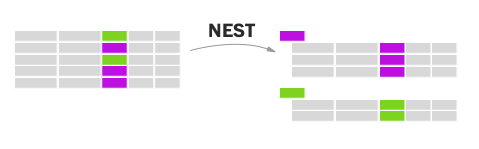

By John Muyskens ([@JohnMuyskens](twitter.com/johnmuyskens)) and Leslie Shapiro ([@lmshap](twitter.com/lmshap)). We are members of the Washington Post graphics team (@postgraphics) who specialize in data journalism.

[Slides](https://docs.google.com/presentation/d/1cAHnGb3YDaa3IHss3mP4a0gH_eDXY6BP-ous2bKY1BI/).

# 1. Grouping data
Goal is to structure your data the way you want your DOM to look.

`Nest` is like "groupBy" in other functional programming languages

[Docs: d3.nest](https://github.com/d3/d3-collection#nests)

`.entries` returns an array

`.map` returns an object which is useful for creating lookup tables. There's also `.object` which you can use if you are sure your data doesn't collide with js reserved words. JS objects not equal to hash tables like python dicts but can be used in much the same way.

[Try it out!](http://bl.ocks.org/jmuyskens/raw/7afd1f9f2b6bd0b767b2df346d39a847/)

# 2. Parsing dates
[Docs: time formatting](https://github.com/d3/d3-time-format)

`d3.dateParse` returns a function that turns a String into a Date

`d3.dateFormat` returns a function that turns a Date into a String

The format DSL is like strptime in other programming languages. It's worth learning the most common arguments.

  var parseTime = d3.timeParse('%a %b %d %H:%M:%S +0000 %Y');
  var formatTime = d3.timeFormat('%Y-%m-%d');
  var parseFormattedTime = d3.timeParse('%Y-%m-%d');

[Try it out!](https://runkit.com/npm/d3-time-format)

# 3. Aggregating data
[Docs: rollup](https://github.com/d3/d3-collection#nest_rollup)

Add a `.rollup()` function that counts number of tweets per day.

# 4. Putting it together
Fork this block: http://blockbuilder.org/jmuyskens/e81ad8e9a3b700bde6c2c45e4421ec79

Copy in your `d3.nest()` code and store the nested data in a variable called `nestedData`.

Modify domain of the x and y-axis using `d3.extent()`.

Change reference in `.data()` to `nestedData`.

Your code will look something like this when you are done: http://blockbuilder.org/jmuyskens/e6dd5b14f7de3bd690a32c414daa4f3a

# 5. Changing scales
[Docs: scaleTime](https://github.com/d3/d3-scale/blob/master/README.md#scaleTime)

`d3.scaleLinear` may not be the most appropriate choice for our x axis. Let's try using `d3.scaleTime` instead.

Extra credit: change the y-axis scale to begin at zero. Hint: use `d3.max()`.

Your code will look something like this when you are done: http://blockbuilder.org/jmuyskens/278992910f1668f670f5d32d63645cb1

# 6. Formatting axes
[Docs: axis ticks](https://github.com/d3/d3-axis#axis_ticks)

Play with the following:

`.tickSize` to specify length of ticks. Try making your axes as wide and tall as your chart.

`.ticks` to specify number of ticks

`.tickFormat` format the tick

Use `.attr('transform', 'translate(TK, TK)')` to move your axis around.

The backbone of the axis is a `<path>` while the ticks are `<line>`s so you can easily style them separately with CSS.

We can make a dashed line with `stroke-dasharray: TKpx TKpx;`.

# 7. Annotate
Add a new `<g>` container for our annotation.

To the `<g>` add a `<line>`.

Also add to the `<g>` a `<text>` to label our line. Use `.text()` to specify your label text.

Translate the `<g>` to a relevant date (for instance, inauguration day, Jan. 20, 2017) using `.attr('translate', 'transform(TK, TK)')`. Hint: use a scale.

Use the svg attributes `text-anchor` (values can be `start`, `middle`, `end`) to justify the text, `dx` and `dy` to adjust the position of the label.

# 8. Scatterplot
With the same data, we'll change from a line chart to a scatterplot.

First let's change the y-axis to chart the variable `favorite_count`. What other line of code do we also need to update?

As opposed to a line, we don't get a handy generator from d3 to make a scatter plot. Instead, we'll use the selectAll() + enter() pattern to add `<circle>`s.

TK circle svg docs link.

You need to specify the following attributes:

- `cx` (x position)
- `cy` (y position)
- `r` (radius)

Set a class using the `source` value in the data and use CSS to change the `fill` on the `<circle>`s.

Your code will look something like this when you are done: http://blockbuilder.org/jmuyskens/12079dc0dcd8d24138b8814afe6659a9

Extra credit: use the *area* of the circle to represent a data attribute.

# 9. Adding interactions
When entering or adding elements chain `.on(EVENTNAME, callback)`. Similar to jQuery, this calls a function when an event happens.

D3 will call your callback function with the datum like you get in other accessor functions. Use `d3.select(this)` to select the element that was triggered.

TK mouse events

Some events:
- mouseenter
- mouseleave
- mouseover
- click

http://blockbuilder.org/jmuyskens/df89fd5d8a5ac0e2890d030f4db5d6cb

# 10. Transitions
First, add a new linear scale for the x axis. Set the domain of this scale based on `retweet_count`.

Then on our `enter()` code for `<circle>` chain `.transition()`. After this, we can change different attributes and d3 will transition them for us.

To slow down the transition, use `.duration(TK ms)`.

Your code will look something like this when you are done: http://blockbuilder.org/jmuyskens/372c0661614876ca736cc6af475a3840

# what's in the advanced class
- Transitions
- Voronoi
- Layouts (force, heirarchy)
- Geo tools
- Modules
- Behaviors (drag and zoom)
- Canvas

# libraries and tools you may find useful
crowbar to download your chart as an SVG. You can then edit it using vector graphics software such as Adobe Illustrator.

[d3-jetpack](https://www.npmjs.com/package/d3-jetpack) for convenience functions that will save you a lot of repetitive typing.

[d3-legend](http://d3-legend.susielu.com/) to make convenient legends based on your scales.

[Textures.js](https://riccardoscalco.github.io/textures/) to use patterns in your visualizations.

[Swoopy drag](https://github.com/1wheel/swoopy-drag) for interactive annotations.
